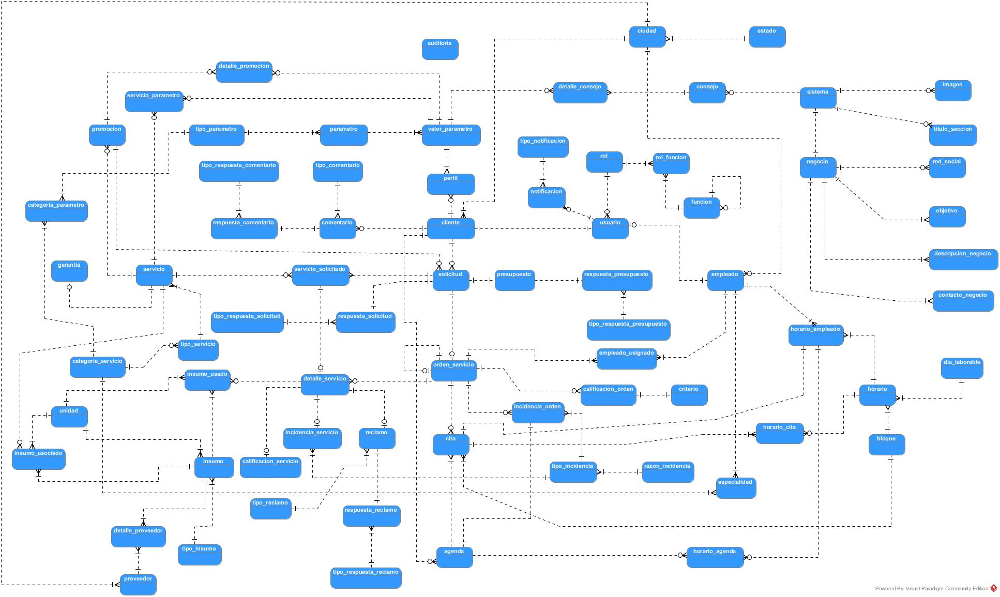

Base de datos para proyecto Mystique
=====================================

Esta base de datos la he diseñado para un sistema de informacion llamado Mystique.
---

Mystique
--------

Mystique es un sistema de información compuesto por una app movil, un portal web, y una aplicación web Desktop. La misma está orientada al apoyo de la gestión de servicios de peluquería y maquillaje.  
El proyecto fue realizado con fines academicos.
Si deseas puedes ir al repositorio --> [Mystique 
-WebDesktop](https://github.com/JoselynG/Web-Desktop)
---

Notas
-----

*La base de datos fue realizada usando postgresql.

*El modelo logico de datos fue realizado con visual paradigm.

*En el repositoria se encuentra dos backups de la BD para que sea restaurada.
*También inclui un script en el que se encuentran sentencias para realizar TRIGGER y VIEW en la BD. Espero te puedan servir de referencia en caso de que te guste SQL.

*Por ultimo el modelo logico de datos.

